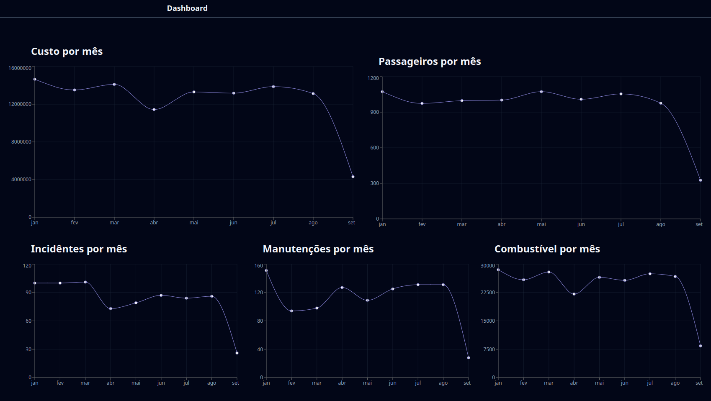
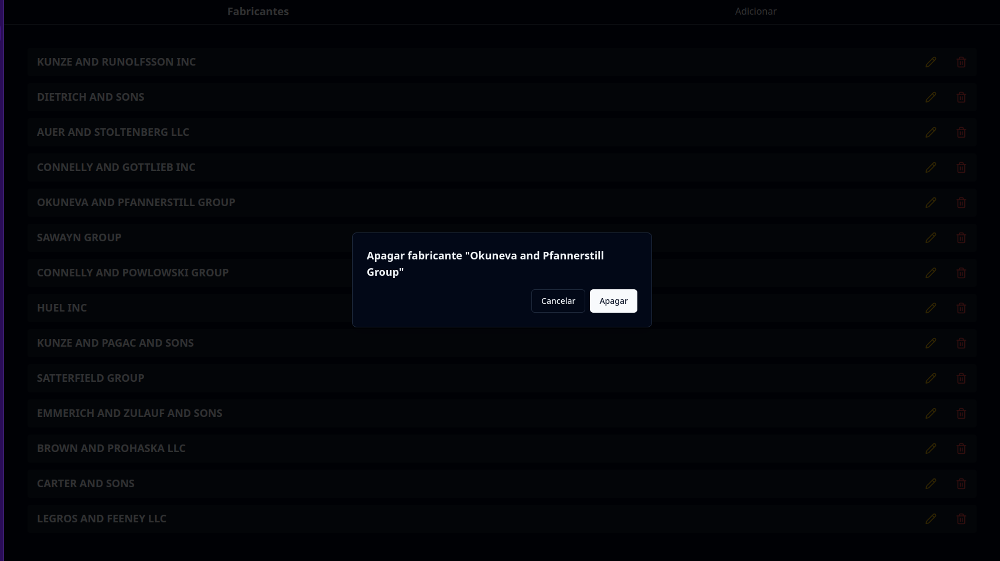
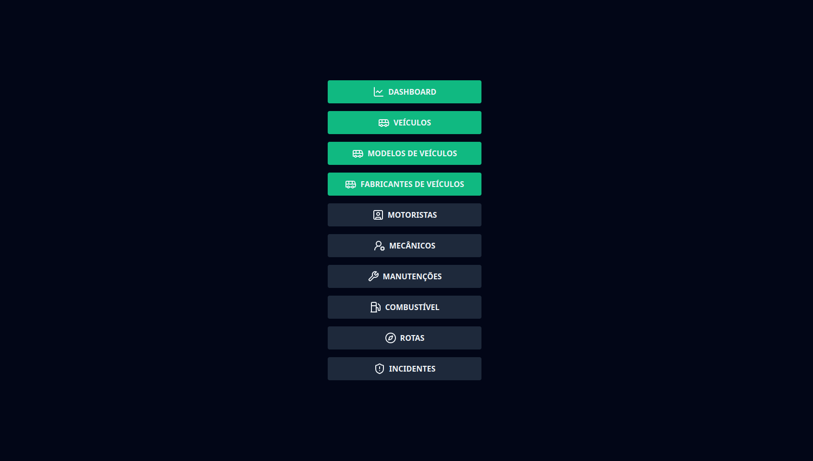
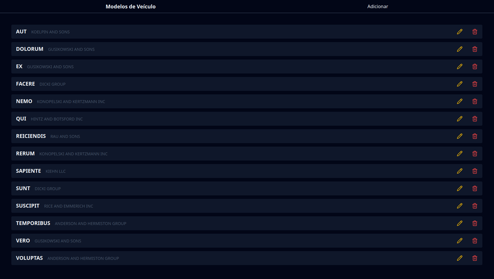
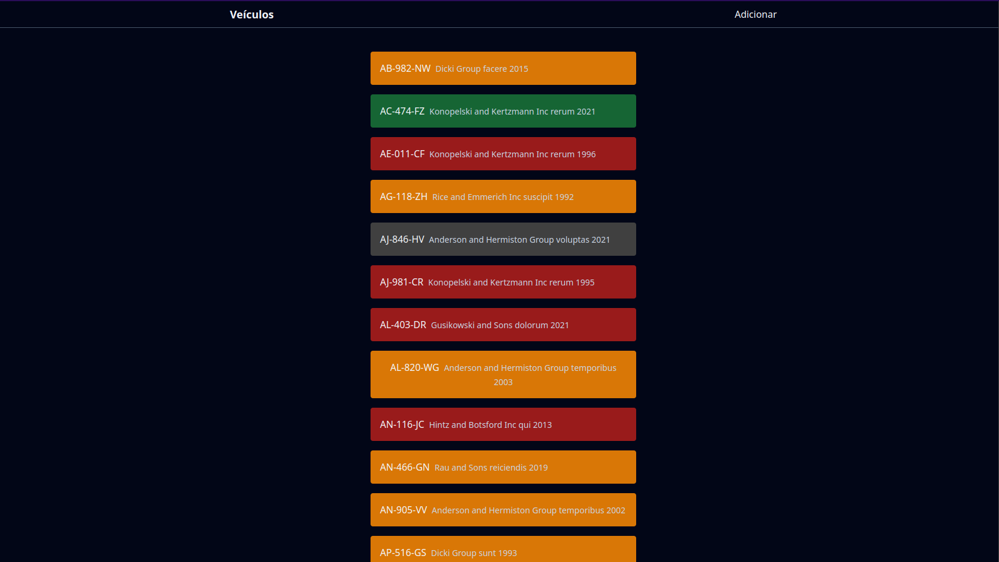

+++
title = "CSC Group - Selection Process"
date = 2024-08-09
description = "This project was developed for the CSC Group selection process"

[extra]
type = "Web Development"
featured = true
techs = ["Axum", "SQLx", "TailwindCSS", "React", "TypeScript", "Shadcn/UI"]
+++

This project was developed for the CSC Group selection process. The project is a vehicle fleet management system, where it is possible to register vehicles, drivers, trips, maintenance, and fuels. The system was not fully implemented, as the development time was short.

The project was developed in Axum, a web framework in Rust, and the frontend was developed in React with TypeScript and TailwindCSS. [Access the repository](https://github.com/igorgcardoso/csc-group)

