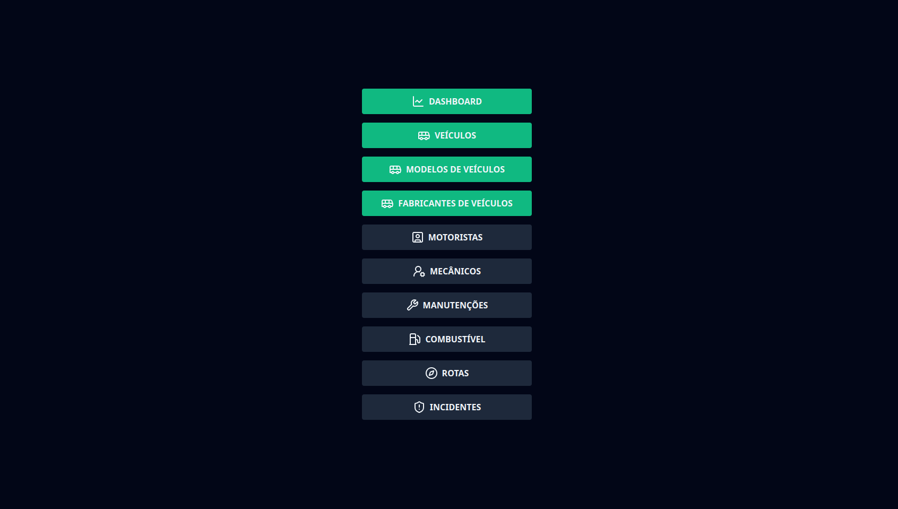
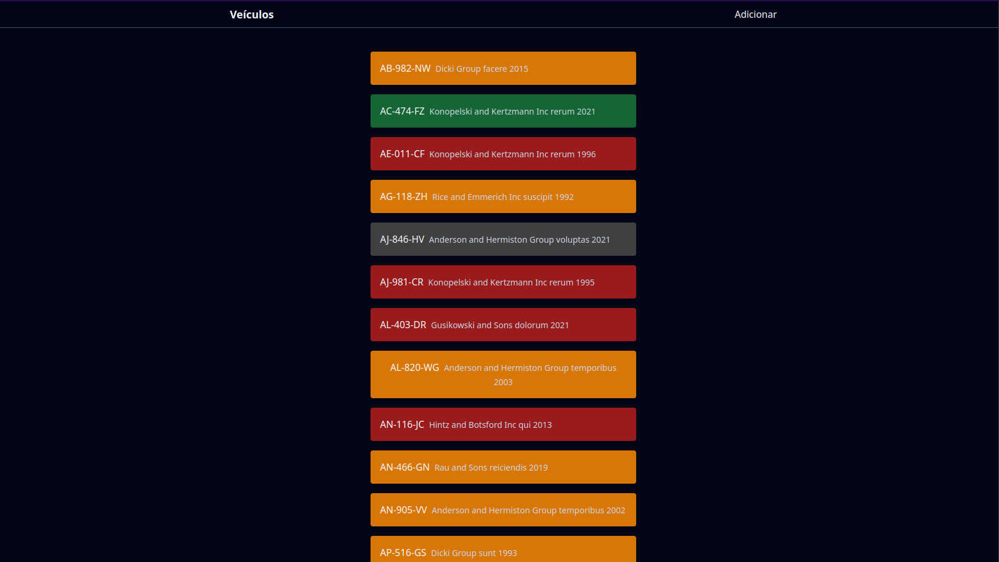

+++
title = "Grupo CSC - Processo de Seleção"
date = 2024-08-09
description = "Este projeto foi desenvolvido para o processo seletivo do Grupo CSC"

[extra]
type = "Desenvolvimento Web"
featured = true
techs = ["Axum", "SQLx", "TailwindCSS", "React", "TypeScript", "Shadcn/UI"]
+++

Projeto desenvolvido para o processo seletivo do Grupo CSC. O projeto é um sistema de gerenciamento de frota de veículos, onde é possível cadastrar veículos, motoristas, viagens, manutenções e combustíveis. O sistema não foi implementado por completo, pois o tempo para desenvolvimento foi curto.

O projeto foi desenvolvido em Axum, um framework web em Rust, e o frontend foi desenvolvido em React com TypeScript e TailwindCSS. [Acesse o repositório](https://github.com/igorgcardoso/csc-group)

