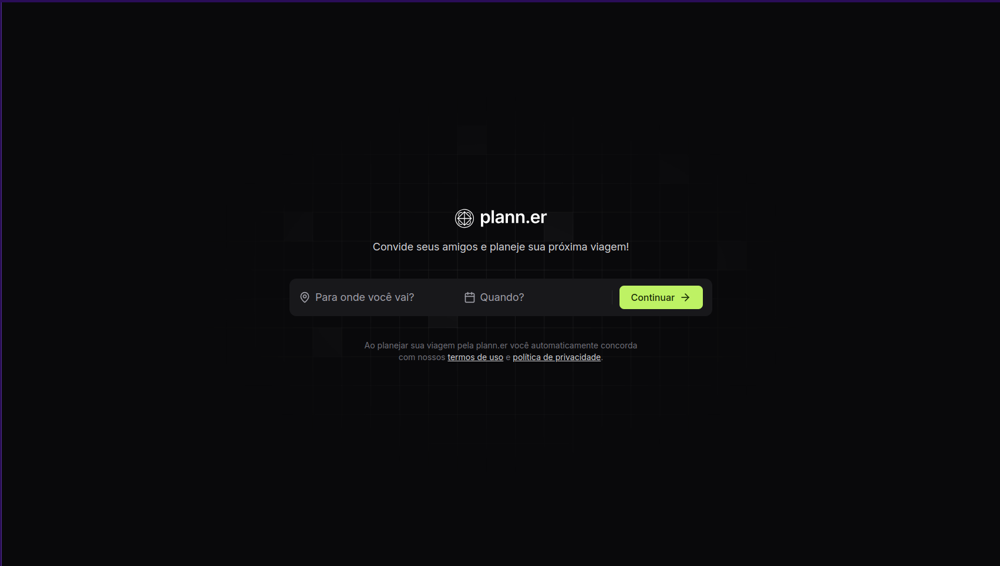
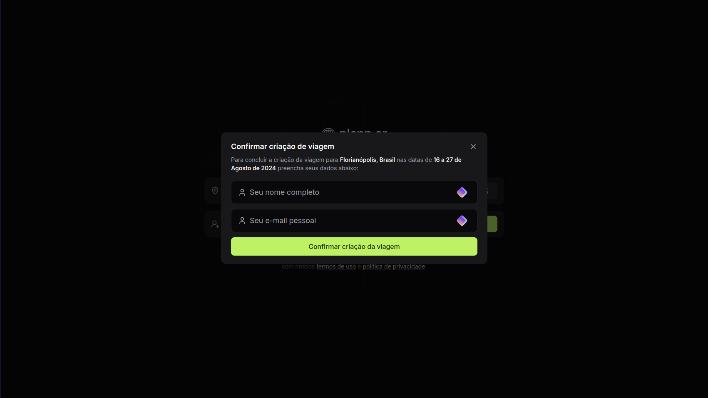
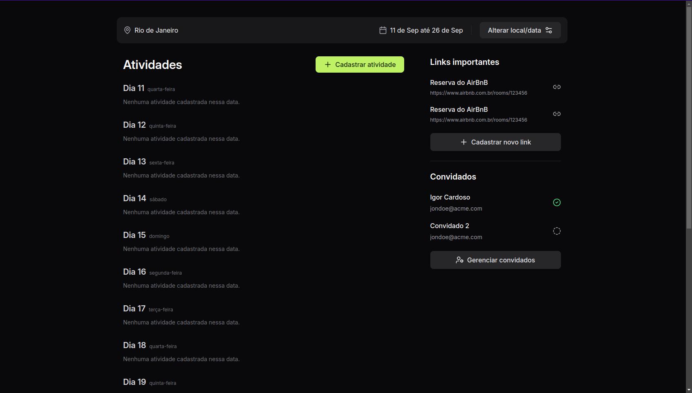

+++
title = "NLW Journey"
date = 2024-07-13
description = "Project developed during the Next Level Week. The project is a collaborative travel planner."

[extra]
type = "Web Development"
featured = false
techs = ["Axum", "SQLx", "TailwindCSS", "React", "TypeScript", "Expo", "Fastify"]
+++

# NLW Journey

Project developed during the Next Level Week. The project is a collaborative travel planner, where the person creates a trip and invites who else will go on the trip. Once the trip is confirmed, the guests receive an email to confirm their attendance. It is possible to add the activities they intend to do during the trip, with the date and time. As well as important links, such as tickets, accommodation, etc.

The project was developed in several different versions, such as one in node, another in rust. And the frontend was developed in React and React Native.

