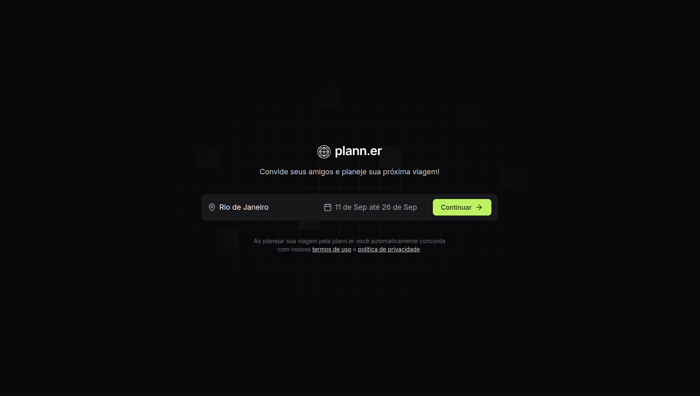
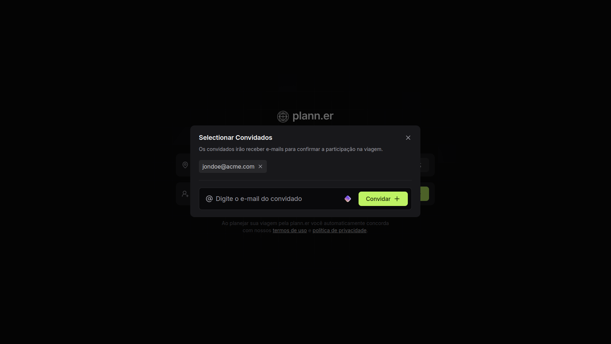
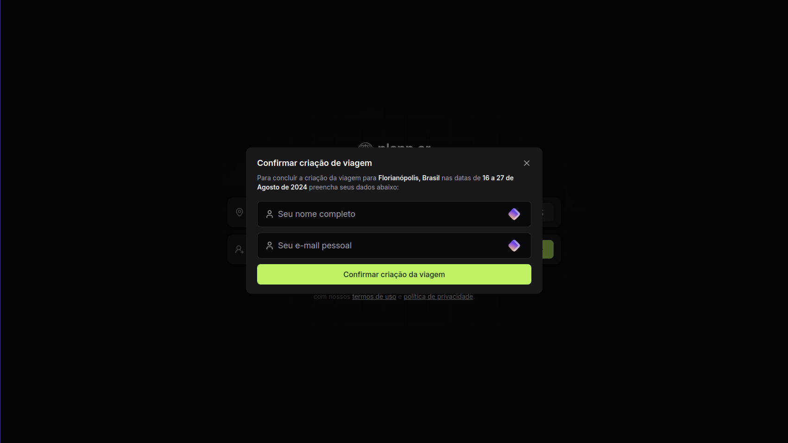
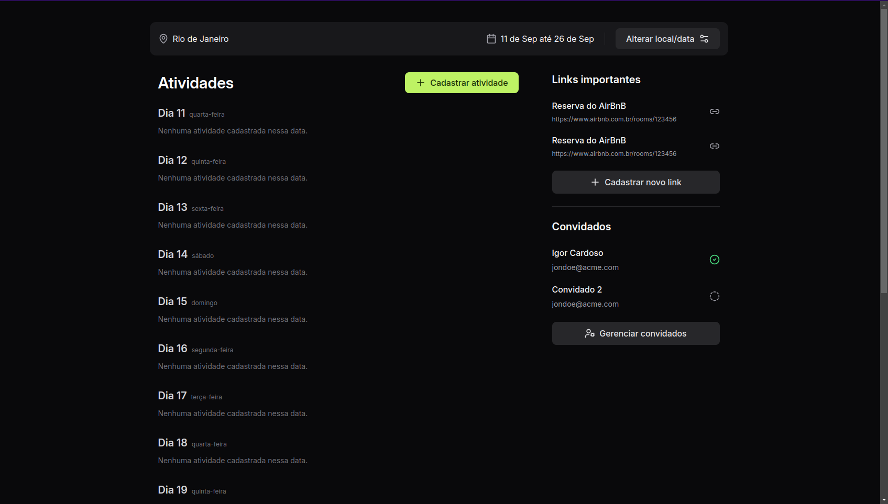

+++
title = "NLW Journey"
date = 2024-07-13
description = "Projeto desenvolvido durante a Next Level Week. O projeto é um planejador de viagens, colaborativo."

[extra]
type = "Desenvolvimento Web"
featured = true
techs = ["Axum", "SQLx", "TailwindCSS", "React", "TypeScript", "Expo", "Fastify"]
+++

# NLW Journey

Projeto desenvolvido durante a Next Level Week. O projeto é um planejador de viagens, colaborativo, onde a pessoa cria uma viagem e convida quem mais irá na viagem. Uma vez confirmada a viagem, os convidados recebem um email para confirmar a presença. É possivel adicionar as atividades que eles pretendem fazer durante a viagem, com a data e horário. Como também links importantes, como passagens, hospedagem, etc.

O projeto foi desenvolvido em algumas versões diferentes, como uma em node, outra em rust. E o frontend foi desenvolvido em React e React Native.

